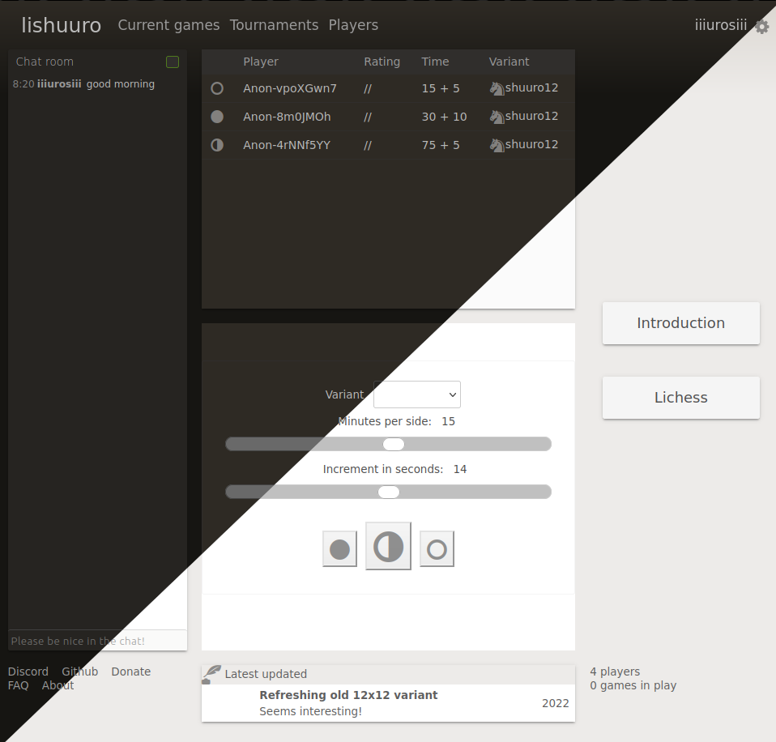

# UI for [lishuuro.org](https://lishuuro.org)



Frontend is created using:

- **Vue 3(TypeScript)** - components and views
- **Chessground12** - 12x12 Chessboard for moving pieces
- **ShuuroWasm** - Generating moves for board
- **Pinia** - managing state in app
- **Valibot** - better type safety 


## Build

Clone backend repo.

```sh
cd ..
git clone https://github.com/uros-5/lishuuro.git
cd ui-lishuuro
```

```sh
pnpm install
sh fetch-boards.sh
sh build.sh
```


Huge thanks goes to pychess and lichess team!
